## Table of contents
* [UX](#ux)
    * [Strategy](#strategy)
        * [Project overview](#project-overview)
        * [Project goals](#project-goals)
    * [Scope](#scope)
        * [Features implemented](#features-implemented)
        * [Features left to implement](#features-left-to-implement)
    * [Structure](#structure)
        * [Database model](#database-model)
    * [Skeleton](#skeleton)
        * [Wireframes](#wireframes)
    * [Surface](#surface)
        * [Colour scheme](#colour-scheme)
        * [Typography](#typography)
        * [Imagery](#imagery)
* [Testing](#testing)
    * [Tests performed](#tests-performed)
    * [Bugs and issues](#bugs-and-issues)
    * [Validator testing](#validator-testing)
* [Deployment](#deployment)
* [Credits](#credits)
    * [Technologies](#technologies)
    * [Resources](#resources)
    * [Content](#content)
    * [Media](#media)
    * [Acknowledgements](#acknowledgements)

# UX

## Strategy

### Project overview

This project is a ficticious hair salon site whereby users can view salon service details. By doing so, the user is be able to make an informed booking with the salon through the website by creating a user account. From the user account the user is also able to view their bookings and change or cancel any of their upcoming bookings.

### Project goals

Below is a list of Epics for this project which have been broken down into user stories. The implementation of these user stories have been planned and managed through the Github Kanban board tool. See the following link to the [Locks of Lush Kanban board](https://github.com/jpatel87/locks-of-lush/projects/1).

All user stories besides the "could have" user stories have been achieved. An effort was made to start the stylists CRUD, however, only the stylist model and admin view was initiated. 

### Epic A: Website content

#### User story A1: Attractive site (Should have)
* As a site user I want to be able to view a site which is attractive yet informative so that I can gain an understanding of the sites purpose and feel inspired to view its related content.

#### User story A2: Service details (Must have)
* As a site user I want to be able to view salon service and price details so that I am aware of what the salon can offer and the cost.

#### User story A3: Stylist details (Should have)
* As a site user I want to be able to view salon stylist background details so that I am able to select the most appropriate stylist for the service I require.

### Epic B: User profile

#### User story B1: User account (Must have)
* As a site user I want to be able to create a user account so that I can login to make a booking.

#### User story B2: Make bookings (Must have)
* As a site user I want to be able to make a booking from my account so that I have better control over my requirements.

#### User story B3: View bookings (Must have)
* As a site user I want to be able to view my bookings from my account so that I have proof that the booking was made.

#### User story B4: Edit bookings (Must have)
* As a site user I want to be able to edit my booking from my account so that I can make changes at a time that is convenient for me.

#### User story B5: Cancel bookings (Must have)
* As a site user I want to be able to cancel my booking from my account so that I can free up my appointment slot for somebody else

#### User story B6: Add reviews (Could have)
* As a user I want to be able to add a review after my appointment so that the salon can improve or maintain its services

### Epic C: Admin profile

#### User story C1: Manage user bookings (Must have)
* As a site admin I want to be able to create, read, update and delete user bookings so that I am aware of the bookings that are being made and can edit or delete them if required.

#### User story C2: Manage services (Should have)
* As a site admin I want to be able to create, read, update and delete service details through the site login so that I have control over the information displayed on the site to make sure it is current.

#### User story C3: Approve reviews (Could have)
* As a admin I want to be able to approve reviews so that they can be displayed on the website

#### User story C4: Manage stylists (Could have)
* As a site admin I want to be able to create, read, update and delete stylist details through the site login so that I have control over the information displayed on the site to make sure it is current.

## Scope

### Features implemented

**Features consistent across all pages**

There are a few features that have been purposely designed to look the same, to allow users to gain familiarity with the site layout and enable them to find information quickly. 

#### Favicon
* A simple favicon has been designed for the site consisting of the first letter of the salon name set in a circle using the site specific colour theme. 
* The purpose of the use of the favicon is to make it easier for the user to identify the site if they have multiple tabs open and therefore helps them remember the site. It also gives the site a professional appearance.

Favicon
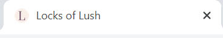

#### Navigation 
* Logo 
    * Consists of the name of the site. 
    * Changes colour upon hover.
    * Can be clicked and it will lead back  to the home page.

* Navigation links
    * Consist of links to the home page, services page, stylists page and the login page.
    * The current page link is permanently underlined to remind users of the page that they are viewing.
    * When the user is logged on, an additional navbar item is added to the navigation menu, which is the name of the user logged on. This is displayed in bold. The purpose of this is to portray to and remind the user that they are successfully logged in. There is a dropdown arrow next to the logged in status which when selected contains a link to the logout page - allowing users to logout.
    * Links are underlined when hovered over.

Example - Navigation view when current page is the login page
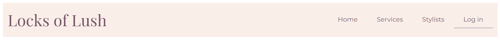

Example - Navigation view when current page is the login page but services link is hovered over
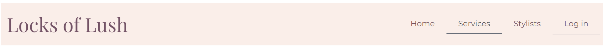

Example - Navigation view when the user is authenticated and if the dropdown arrow is selected next to the logged in status
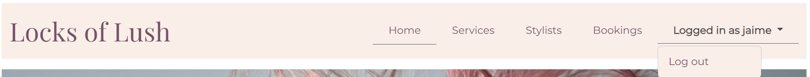

#### Footer
* Social links
    * Icons for social media sites; twitter, facebook and instagram are present and can be clicked to direct users to the social media sites. These enable users to review salon news and get in touch via social media with ease.
    * Icons change colour upon hover for added effect.
* Email link
    * Mail icon present which can be clicked to open up an email page with the salon email pre-populated - to allow users to get in touch with the salon easily.
    * Icon changes colour upon hover for added effect.
* Contact us container
    * The contact details consisting of address, telephone number and opening times for the salon is kept in the footer as this information is most important for all users to have at hand.
    * A "book now" action button is also present in the contact us container to encourage users to book. The button is a different colour to other buttons across the site and the text is uppercase to highlight its importance. The button also changes colour upon hover for added effect. 
    * If the user is not logged on, when the "book now" button is clicked it leads to the login page - making the user aware that to book an appointment via the website they must login/create an account first. 
    * If the user is logged on, when the "book now" button is clicked it leads to the "Make booking" page - to allow users to quickly make a booking without going through links on different pages.

Example - footer contact us container 

Example - footer contact us container with book now button hovered over

Example - footer social media/email links with twitter link hovered over

#### Page summary container
* Heading 
    * Each page has a summary container which consists of a heading which serves as a reminder to the users of the subject of the page.
    * All titles are on a grey background and the text is of a different font to the body to emphasize the purpose of the page.
* Body
    * The body of the container is coloured in a light pink colour and the text is grey to make it stand out on the background. The text in each body is kept to a minimum with key information to keep the reader interested.

Example: Services page container and header:

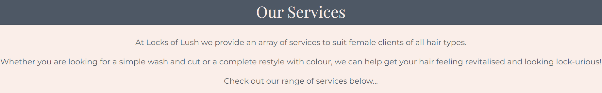

#### Buttons (besides footer button)
* Each button has a background colour of purple with light pink text to make the text stand out. 
* The text on each button is in uppercase to highlight its importance.
* Upon hover the button background changes colour to grey for added effect.

Example: Login button

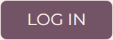

Example: Login button which is hovered over

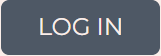

**Features unique to each page**

#### Home page

The main goals of the home page is to attract the users attention and provide a brief summary of what the salon offers.

* Hero image 
    * The hero image selected is striking and easily conveys the purpose of the site (ie. hair services) for a first time user and inspires them to visit the site content. 

* Slogan
    * The slogan of the site is short and catchy and captures part of the salon name in order render it memorable for a user. 

Hero image and slogan 

* Service overview
    * The services that the salon offers is summarised in three images with buttons that link to the services page to provide more information. The images chosen are bright and joyful to attract the user to find out more.

Services overview
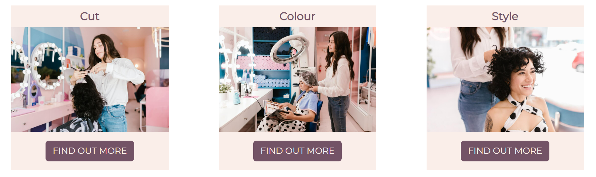

#### Services page

* Services overview 
    * The services overview is a short summary of what the salon can offer and it has been worded in such a way to promote the salons services and make the read want to find out more.
    * If an admin user is logged on - they are also given the option to add a service via an "Add service" button link in this overview container. Non admin users will not see this button. This is useful for hairdresser businesses who regularly update their services to keep up to date with the trends. 

* Services accordion
    * The services accordion consists of three accordion items each holding information about three separate types of services offered by the salon.
    * The reason an accordion was selected as a means to convey service details is because it keeps the site looking minimalistic and adds elegance and a level of user interactivity.
    * Each service type accordian item contains service names and prices.
    * If an admin user is logged on, the accordion items will also give options to edit or delete services. Non-admin users do not have the access to see these options from their accounts. This is useful for hairdresser businesses to change or delete service and price options as per supply and demand.

Services accordion
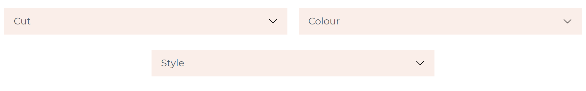

Services accordion with the style acordion item selected

Services accordion with the style acordion item selected- view when an admin user is logged on
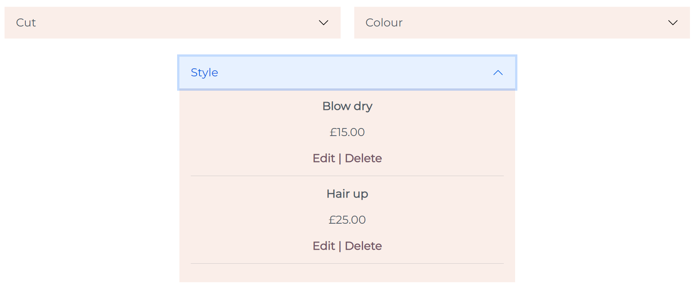

#### Stylists page

* Stylists overview 
    * The stylists overview is a short summary of what users can expect from the salon stylists. It aims persuade the user that the salon stylists are trustworthy.

Services accordion with the style acordion selected
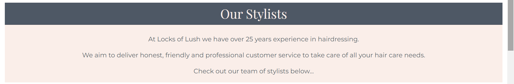
    
* Stylist details
    * Each salon stylist has their name, image and brief experience details captured on the page so that users are able to relate to the stylists so that they can make an informed decision when it comes to booking.
    * The image of the stylist is rounded to add elegance.

Example - stylists
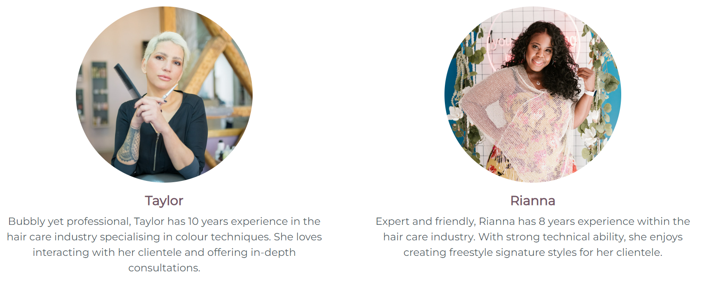

#### Login/Sign up/Log out pages

* Login, sign up and log out requests are handled by [Django allauth](https://django-allauth.readthedocs.io/en/latest/installation.html), only the layout of the forms were designed by the project owner.
* All pages have been designed consistently as per the "page summary container" section (see "features consistent across all pages") so that the user is able to easily develop familiarity with the site layout. 
* The logout page has a further button to cancel the request - if the user had made a mistake to select logout. If the cancel button is selected the user is re-directed back to the bookings page. If the logout button is selected the user is logged out and redirected back to the home page.  
* If a user login/sign up details are incorrect, Django allauth has error messages which show up on the forms to indicate the error.

Login page

Signup page
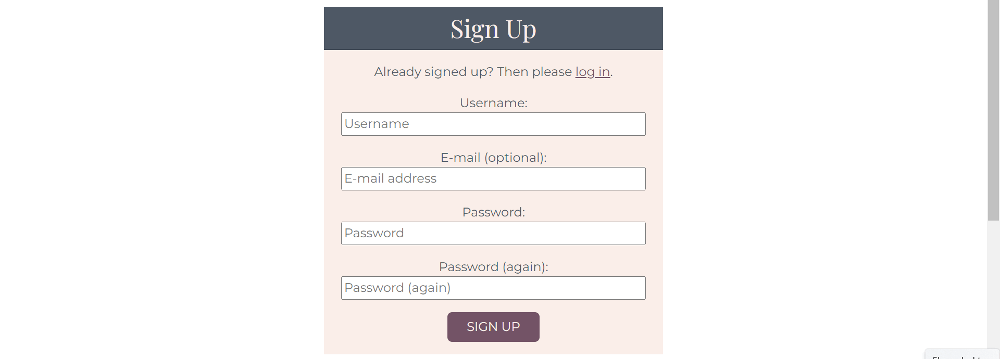

Logout page
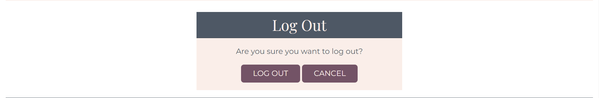

### Features left to implement

## Structure 

### Database model

Below is a link to the ERD created for this project.

This Entity Relationship Diagram (ERD) has been generated using [Lucidchart](https://www.lucidchart.com/pages/landing?utm_source=google&utm_medium=cpc&utm_campaign=_chart_en_tier1_mixed_search_brand_exact_&km_CPC_CampaignId=1490375427&km_CPC_AdGroupID=55688909257&km_CPC_Keyword=lucid%20chart&km_CPC_MatchType=e&km_CPC_ExtensionID=&km_CPC_Network=g&km_CPC_AdPosition=&km_CPC_Creative=442433236001&km_CPC_TargetID=kwd-55720648523&km_CPC_Country=9045963&km_CPC_Device=c&km_CPC_placement=&km_CPC_target=&gclid=Cj0KCQjwyYKUBhDJARIsAMj9lkGuAWT49rmauAUKPE1dZc32REnshWbCY-h0UoYogZ4mtAhFjn8IypsaAoYNEALw_wcB)

This ERD model contains four entities, which are the booking, stylist, service and user models (note: the user model was created by django allauth). Each entity has various attributes (ie. properties), e.g the service entity has name, service type and price as its attributes. These attributes are further characterised through the django field data type, which specifies how instances of the attributes are to be stored e.g the service entity, name attribute is to be stored as a character field (Charfield).

The stylist, service and user entities act as foreign keys (FK) in the bookings entity, through their the unique ids primary keys (PK). They all have a zero to many relationship with the booking entity ie. a stylist/service/user can either have zero or many bookings. Whereas, the booking entity has a one to one relationship with stylist/service/user entities; ie one booking can only have one stylist, service and user. 

* [Locks of Lush - Entity Relationship Diagram](readme_documents/erd/erd-model.png)

## Skeleton

### Wireframes

Below are links to the initial wireframes created for this project. During development, plans were slightly modified in order to improve the user experience. 

* [Home page](readme_documents/wireframes/home-wireframe.png)

* [Services page](readme_documents/wireframes/services-wireframe.png)

* [Stylists page](readme_documents/wireframes/stylists-wireframe.png)

* [Login page](readme_documents/wireframes/login-wireframe.png)

* [Sign-up page](readme_documents/wireframes/signup-wireframe.png)

* [Bookings page](readme_documents/wireframes/bookings-wireframe.png)

* [Manage bookings page](readme_documents/wireframes/manage-bookings-wireframe.png)

## Surface

### Colour scheme

The colour scheme used in this site consist of colours; #faeee9 (light pink), #735366 (purple) and #4e5865 (dark grey). These colours give the site a feminine yet stylish look.

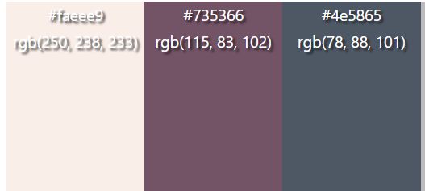

### Typography 

There are two fonts used in this site which were sourced from [Google fonts](https://fonts.google.com/). Playfair Display (serif) has been used for the site logo and page headings and Montserrat (sans-serif) for the site body text. The combination of these two fonts give the site a minimalistic and clean look.

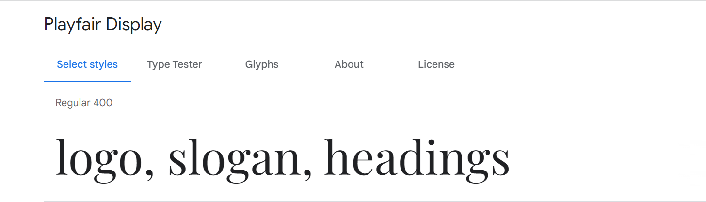
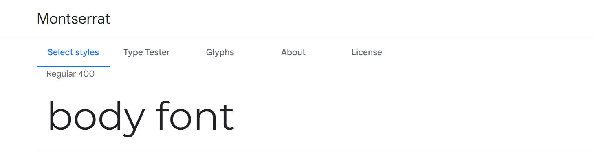

### Imagery

The hero image used for the home page has been sourced from [Unsplash](https://unsplash.com/). The stylists images on the home page and the stylists page have been sourced from [Pexels](https://www.pexels.com/). 

The hero image was selected as it effectively portrays to the user the intent of the site in a striking manner. The stylists images that have been selected add further vibrancy and freshness to the site which help to draw the users attention. All images were chosen as they also coordinated well with the colour theme of this site. 

Images were compressed using [Tiny png](https://tinypng.com/) in order to improve site load times for better user experience. 

## Testing 

### Tests performed

### Bugs and issues

### Validator testing

## Deployment 

A thorough walkthrough of the deployment steps taken for this project can be viewed in the below document. 

* [Test](readme_documents/deployment_steps/deployment_procedure.pdf)

## Credits

### Technologies 

The languages used for this project are: 

- HTML 
- CSS
- Python 

The frameworks used for this project are:

- [Django](https://www.djangoproject.com/) 
- [Bootstrap](https://getbootstrap.com/)

The libraries used for this project are:

- [Google fonts](https://fonts.google.com/)

The databases used for this project is:

- Postgres

The storage hosts used for this project are:
- [Github](https://github.com/)
- [Heroku](https://www.heroku.com/)
- [Cloudinary](https://cloudinary.com/?utm_source=google&utm_medium=cpc&utm_campaign=Rbrand&utm_content=492438439811&utm_term=%2Bcloudinary&gclid=Cj0KCQjwma6TBhDIARIsAOKuANwhiuq0ZxvF_2j7ANjz39RqGHZUM1DEgNRzc_zb4Yymv18YBGbHrMYaAgMREALw_wcB)

Other:

Other packages used in this project are:

- [Lucidchart](https://www.lucidchart.com/pages/landing?utm_source=google&utm_medium=cpc&utm_campaign=_chart_en_tier1_mixed_search_brand_exact_&km_CPC_CampaignId=1490375427&km_CPC_AdGroupID=55688909257&km_CPC_Keyword=lucid%20chart&km_CPC_MatchType=e&km_CPC_ExtensionID=&km_CPC_Network=g&km_CPC_AdPosition=&km_CPC_Creative=442433236001&km_CPC_TargetID=kwd-55720648523&km_CPC_Country=9045963&km_CPC_Device=c&km_CPC_placement=&km_CPC_target=&gclid=Cj0KCQjwyYKUBhDJARIsAMj9lkGuAWT49rmauAUKPE1dZc32REnshWbCY-h0UoYogZ4mtAhFjn8IypsaAoYNEALw_wcB) - used to create the Entity Relationship Diagram (ERD)
- [Balsamiq](https://balsamiq.com/wireframes/?gclid=CjwKCAjw9-KTBhBcEiwAr19igzgSMCAHTuTIsTpGrtk-KZPATPmc7R0M9oo0VUs2jhgbGpmXmCnKSxoCstwQAvD_BwE) - used to create the wireframes
- [Tiny png](https://tinypng.com/) - used to compress images.

### Resources

### Content 

### Media 

- [Home page - Hero image](https://unsplash.com/photos/qJKT2rMU0VU)
- [Home page - Cut stylist](https://www.pexels.com/photo/a-woman-in-white-long-sleeve-shirt-7755207/)
- [Home page - Colour stylist](https://www.pexels.com/photo/a-hairdresser-attending-a-client-7755499/)
- [Home page - Style stylist](https://www.pexels.com/photo/a-woman-getting-her-hair-done-in-the-salon-7755651/)

### Acknowledgements

I would like to offer my sincere thanks to my mentor Brian Macharia for all his advice and guidance throughout this project. My thanks also extends to the entire [Code Institute](https://codeinstitute.net/full-stack-software-development-diploma/?utm_term=code%20institute&utm_campaign=CI+-+UK+-+Search+-+Brand&utm_source=adwords&utm_medium=ppc&hsa_acc=8983321581&hsa_cam=1578649861&hsa_grp=62188641240&hsa_ad=581730217381&hsa_src=g&hsa_tgt=kwd-319867646331&hsa_kw=code%20institute&hsa_mt=e&hsa_net=adwords&hsa_ver=3&gclid=CjwKCAjw14uVBhBEEiwAaufYxzLItLILR2VKJH9mFRvzp_QbO7Gm2bbD9VZW_emQabtiDlH2qb665BoCvd0QAvD_BwE) Tutors who have been fantastic with troubleshooting. 
