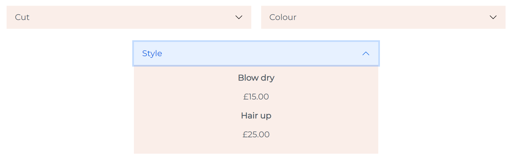
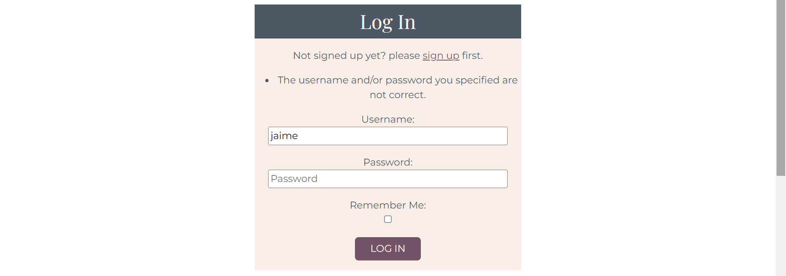
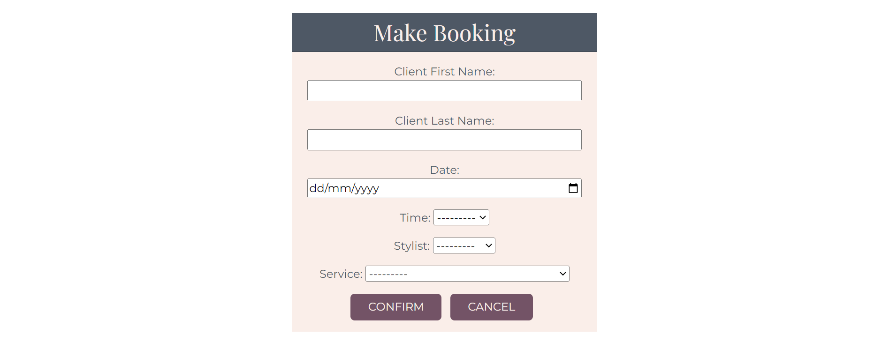
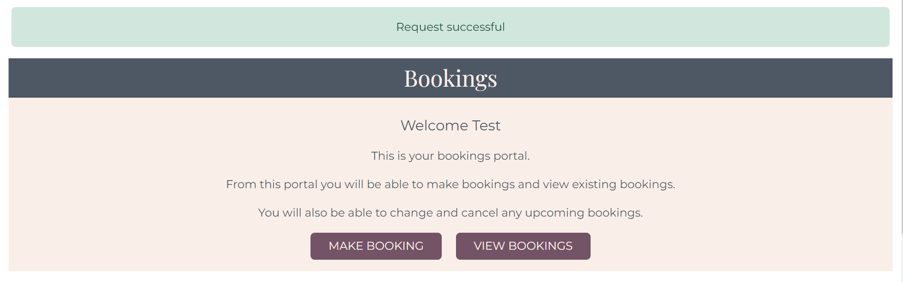
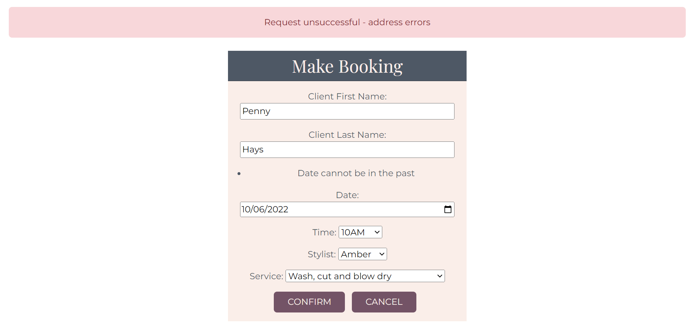

## Table of contents
* [UX](#ux)
    * [Strategy](#strategy)
        * [Project overview](#project-overview)
        * [Project goals](#project-goals)
    * [Scope](#scope)
        * [Features implemented](#features-implemented)
        * [Features left to implement](#features-left-to-implement)
    * [Structure](#structure)
        * [Database model](#database-model)
    * [Skeleton](#skeleton)
        * [Wireframes](#wireframes)
    * [Surface](#surface)
        * [Colour scheme](#colour-scheme)
        * [Typography](#typography)
        * [Imagery](#imagery)
* [Testing](#testing)
    * [Tests performed](#tests-performed)
    * [Bugs and issues](#bugs-and-issues)
    * [Validator testing](#validator-testing)
* [Deployment](#deployment)
* [Credits](#credits)
    * [Technologies](#technologies)
    * [Resources](#resources)
    * [Content](#content)
    * [Media](#media)
    * [Acknowledgements](#acknowledgements)

# UX

## Strategy

### Project overview

This project is a ficticious hair salon site whereby users can view salon service details. By doing so, the user is be able to make an informed booking with the salon through the website by creating a user account. From the user account the user is also able to view their bookings and change or cancel any of their upcoming bookings.

### Project goals

Below is a list of Epics for this project which have been broken down into user stories. The implementation of these user stories have been planned and managed through the Github Kanban board tool. See the following link to the [Locks of Lush Kanban board](https://github.com/jpatel87/locks-of-lush/projects/1).

All user stories besides the "could have" user stories have been achieved. An effort was made to start the stylists CRUD, however, only the stylist model and admin view was initiated. 

### Epic A: Website content

#### User story A1: Attractive site (Should have)
* As a site user I want to be able to view a site which is attractive yet informative so that I can gain an understanding of the sites purpose and feel inspired to view its related content.

#### User story A2: Service details (Must have)
* As a site user I want to be able to view salon service and price details so that I am aware of what the salon can offer and the cost.

#### User story A3: Stylist details (Should have)
* As a site user I want to be able to view salon stylist background details so that I am able to select the most appropriate stylist for the service I require.

### Epic B: User profile

#### User story B1: User account (Must have)
* As a site user I want to be able to create a user account so that I can login to make a booking.

#### User story B2: Make bookings (Must have)
* As a site user I want to be able to make a booking from my account so that I have better control over my requirements.

#### User story B3: View bookings (Must have)
* As a site user I want to be able to view my bookings from my account so that I have proof that the booking was made.

#### User story B4: Edit bookings (Must have)
* As a site user I want to be able to edit my booking from my account so that I can make changes at a time that is convenient for me.

#### User story B5: Cancel bookings (Must have)
* As a site user I want to be able to cancel my booking from my account so that I can free up my appointment slot for somebody else

#### User story B6: Add reviews (Could have)
* As a user I want to be able to add a review after my appointment so that the salon can improve or maintain its services

### Epic C: Admin profile

#### User story C1: Manage user bookings (Must have)
* As a site admin I want to be able to create, read, update and delete user bookings so that I am aware of the bookings that are being made and can edit or delete them if required.

#### User story C2: Manage services (Should have)
* As a site admin I want to be able to create, read, update and delete service details through the site login so that I have control over the information displayed on the site to make sure it is current.

#### User story C3: Approve reviews (Could have)
* As a admin I want to be able to approve reviews so that they can be displayed on the website

#### User story C4: Manage stylists (Could have)
* As a site admin I want to be able to create, read, update and delete stylist details through the site login so that I have control over the information displayed on the site to make sure it is current.

## Scope

### Features implemented

**Features consistent across all pages**

There are a few features that have been purposely designed to look the same, to allow users to gain familiarity with the site layout and enable them to find information quickly. 

#### Favicon
* A simple favicon has been designed for the site consisting of the first letter of the salon name set in a circle using the site specific colour theme. 
* The purpose of the use of the favicon is to make it easier for the user to identify the site if they have multiple tabs open and therefore helps them remember the site. It also gives the site a professional appearance.

| Image | Description |
| --- | --- |
|  | Favicon seen besides title in site tab |

#### Navigation 
* Logo 
    * Consists of the name of the site. 
    * Changes colour upon hover.
    * Can be clicked and it will lead back  to the home page.

* Navigation links
    * Consist of links to the home page, services page, stylists page and the login page.
    * The current page link is permanently underlined to remind users of the page that they are viewing.
    * When the user is logged on, two additional navbar items are added to the navigation menu. There is the name of the user logged on displayed as "logged on as [username]". This is displayed in bold. The purpose of this is to portray to and remind the user that they are successfully logged in. There is a dropdown arrow next to the logged in status which when selected contains a link to the logout page - allowing users to logout. The other extra navigation item is "Bookings" from where users can perform CRUD operations from.
    * Links are underlined when hovered over.

| Image | Description |
| --- | --- |
|  | Navigation view when current page is the login page |
|  | Navigation view, current page is the login page, services link hovered over |
|  | Navigation view when the user is logged on |

#### Footer 
* Social links
    * Icons for social media sites; twitter, facebook and instagram are present and can be clicked to direct users to the social media sites. These enable users to review salon news and get in touch via social media with ease.
    * Icons change colour upon hover for added effect.
* Email link
    * Mail icon present which can be clicked to open up an email page with the salon email pre-populated - to allow users to get in touch with the salon easily.
    * Icon changes colour upon hover for added effect.
* Contact us container
    * The contact details consisting of address, telephone number and opening times for the salon is kept in the footer as this information is most important for all users to have at hand.
    * A "book now" action button is also present in the contact us container to encourage users to book. The button is a different colour to other buttons across the site and the text is uppercase to highlight its importance. The button also changes colour upon hover for added effect. 
    * If the user is not logged on, when the "book now" button is clicked it leads to the login page - making the user aware that to book an appointment via the website they must login/create an account first. 
    * If the user is logged on, when the "book now" button is clicked it leads to the "Make booking" page - to allow users to quickly make a booking without going through links on different pages.

| Image | Description |
| --- | --- |
|  | Footer - contact us |
|  | Footer - contact us, book now button hovered over
|  | Footer - social media/email links, twitter link hovered over

#### Page summary
* Heading 
    * Each page has a summary which consists of a heading which serves as a reminder to the users of the subject of the page.
    * All titles are on a grey background and the text is of a different font to the body to emphasize the purpose of the page.
* Body
    * The body of the container is coloured in a light pink colour and the text is grey to make it stand out on the background. The text in each body is kept to a minimum with key information to keep the reader interested.

| Image | Description |
| --- | --- |
|  | Services page summary |

#### Buttons (besides footer button)
* Each button has a background colour of purple with light pink text to make the text stand out. 
* The text on each button is in uppercase to highlight its importance.
* Upon hover the button background changes colour to grey for added effect.

| Image | Description |
| --- | --- |
|  | Login button |
|  | Login button hovered over

**Features unique to each page**

#### Home page 

The main goals of the home page is to attract the users attention and provide a brief summary of what the salon offers.

* Hero image 
    * The hero image selected is striking and easily conveys the purpose of the site (ie. hair services) for a first time user and inspires them to visit the site content. 

* Slogan
    * The slogan of the site is short and catchy and captures part of the salon name in order render it memorable for a user. 

* Service overview
    * The services that the salon offers is summarised in three images with buttons that link to the services page to provide more information. The images chosen are bright and joyful to attract the user to find out more.

| Image | Description |
| --- | --- |
|  | Hero image and slogan |
|  | Services overview |

#### Services page 

* Services summary 
    * Short summary of what the salon can offer.
    * If an admin user is logged on - a button link is also displayed to "Add service". Non admin users will not see this button. This is useful for hairdresser businesses who regularly update their services to keep up to date with the trends. 

* Add service
    * By clicking on the "Add service" button the admin user will be directed to a "Add service page"
    * A form will display with the following fields; Service name, Service type (dropdown list) and price. 
    * All fields are required - so if any information is left out the form will not submit and the user will be notified to either fill in the field or select an item.
    * If the admin submits a valid form, they will be re-directed to the bookings page and a message will be displayed at the top of the page informing them that the request was successful.
    * If the form is completed in full but the information is not valid - then an error message will be displayed at the top of the page informing the admin user that the request was unsuccessful and requesting them to address the errors.
    * An error message will be displayed if the admin user inputs a price below £15, above £300 or greater than 3 digits before the decimal place (e.g £1000). This is because upon my research of hairdresser prices, it is unlikely that a service is going to be less than £15 or above £300 therefore it is likely that the admin had made a mistake. 

* Services accordion
    * The services accordion was created using the accordion flush template supplied by [Bootstrap, accordion](https://getbootstrap.com/docs/5.0/components/accordion/).
    * The services accordion consists of three accordion items each holding information about three separate types of services offered by the salon.
    * The services in each accordion item are ordered in alphabetical order and the first letter of each service name is automatically capitalised even if the admin failed to enter it in this way. The benefit of this is to ensure the formatting of each service is consistent to keep the site looking professional. 
    * The reason an accordion was selected as a means to convey service details is because it keeps the site looking minimalistic and adds elegance and a level of user interactivity.
    * Each service type accordian item contains service names and prices.
    * If an admin user is logged on, then below each service price the admin will see links to "edit" or "delete" services. Non-admin will not see these options. This is useful for hairdresser businesses to change or delete service and price options as per supply and demand.

* Edit service  
    * If the admin user chooses to edit a service - they will be directed to a "Edit service" page.
    * The "Edit service" form pre-populates with all of the initial service details.
    * The same incomplete/error/success messages and redirects apply as the "Add service" page.
    * At the end of the form the admin user is given the option to confirm or cancel the edit.These options are useful as they serve as an additional safety measure to prevent the admin user from making a change they do not intend to.  

* Delete service
    * If the admin user chooses to delete a service - they will be directed to a "Delete service" page.
    * The delete message will ask the user to confirm if they want to delete the service name.
    * The user will be given the option to go ahead with the deletion (yes) or cancel (no).
    * If they confirm - the user will be re-directed back to the bookings page, a success message will be displayed at the top of the services page to say that their request was successful and the service will no longer appear in the service accordion table.
    * If they cancel - they will be re-directed to the services page.

| Image | Description |
| --- | --- |
| | Services summary - admin view |
| | Add service page |
| | Services page - success message if service added/edited/deleted |
| | Add service page - incomplete form |
| | Add service page - incorrect form, price too low |
| | Add service page - incorrect form, price high |
| | Add service page - incorrect form, price too high |
|  | Services accordion |
|  | Services accordion - style acordion item selected |
|  |Services accordion - style accordion item selected - admin view |
|  | Edit service page |
|  | Delete service page |

#### Stylists page

* Stylists summary 
    * Short summary of what users can expect from the salon stylists.
    
* Stylist details
    * Each salon stylist has their name, image and brief experience details captured on the page so that users are able to relate to the stylists so that they can make an informed decision when it comes to booking.
    * The image of the stylist is rounded to add elegance.

| Image | Description |
| --- | --- |
|  | Stylists summary |
|  | Stylist details

#### Authentication pages 

* Login, sign up and log out requests are handled by [Django allauth](https://django-allauth.readthedocs.io/en/latest/installation.html), only the layout of the forms were designed by the project owner.
* All pages have been designed consistently as per the "page summary container" section (see "features consistent across all pages") so that the user is able to easily develop familiarity with the site layout. 
* When users log on they are directed to the home page.
* The logout page has a button to cancel the request - if the user had made a mistake to select logout. If the cancel button is selected the user is re-directed back to the bookings page. If the logout button is selected the user is logged out and redirected back to the home page.  
* If a user login/sign up details are incorrect, Django allauth has error messages which show up on the forms to indicate the error.

| Image | Description |
| --- | --- |
|  | Login page with allauto error message |
|  | Signup page |
|  | Logout page |

#### Bookings page 

The bookings page can only be seen if the user is logged on.

* Bookings summary
    * Welcomes the user by name to the bookings portal (page).
    * It provides instructions to the user of what they are able to do from the bookings portal. 
    * There is a "Make booking" button which can be clicked to open up the "Make booking" page.
    * There is a "View bookings" button which is a [Bootstrap, collapse button](https://getbootstrap.com/docs/5.0/components/collapse/) that has been used to toggle the visibility of the bookings table which appears below the bookings summary.

* Make booking
    * There are two separate "make booking" forms - one for the admin and one for the user. The only difference between them is that the admin form displays the user field to enable the admin to select a user from a dropdown list to book an appointment for. Whereas the user form does not display the user id field at all - it takes the logged in user's id automatically for the booking they make. This is to stop users from having control over any others users bookings.
    * The "make booking" form contains the following required entries; client first name, client last name, date, time, stylist and service.
    * All fields are required - so if any information is left out the form will not submit and the user will be notified to either fill in the field or select an item.
    * If the user submits a valid form, they will be re-directed to the bookings page and a message will be displayed at the top of the page informing the user that the request was successful.
    * If the form is completed in full but the information is not valid - then an error message will be displayed at the top of the page informing the user that the request was unsuccessful and requesting them to address the errors.
    * Error messages will be displayed if the user selects a date in the past or a combination of date, time and stylist that has already been booked.

* View bookings
    * The table of bookings displays the following information; client (first name and last name), service name, appointment (date, time, stylist) and buttons to enable appointments to be changed or cancelled for upcoming appointments. For past appointments, an entry is made to say "booking cannot be amended".
    * If the change booking button is selected then the edit bookings form is called.
    * If the cancel bookings button is called then the delete bookings form is called.
    * Bookings are displayed in date order - starting with the earliest appointment first.

[ADD PAST APPOINTMENT IMAGE OF BOOKINGS PAGE to show dat order too]

* Change booking
    * The "change booking" form pre-populates with all the initial appointment details and works in the same way as the "make booking" form in terms of error handling and redirecting.
    * At the end of the form the user is given the option to confirm or cancel the change.These options are useful as they serve as an additional safety measure to prevent the user from making a change they do not intend to.  
 
* Delete bookings
    * The delete booking page displays a message to the user relaying the appointment details (service, date, time and stylist) they requested to delete and asks them to confirm or cancel the deletion.
    * If they confirm - the user will be re-directed back to the bookings page, a success message will be displayed at the top of the bookings page to say that their request was successful and the booking will no longer appear in the bookings table.
    * If they cancel - they will be re-directed to the bookings page.

| Image | Description |
| --- | --- |
|  | Bookings summary |
|  | Make booking admin form, with user field |
|  | Make booking user form - for with no user field |
|  | Bookings page with success message, if booking, change or cancellation was successful |
|  | Make bookings page, error message at the top due to a past date being chosen |
|  | Cancel booking page example |

### Features left to implement

## Structure 

### Database model

Below is a link to the ERD created for this project.

This Entity Relationship Diagram (ERD) has been generated using [Lucidchart](https://www.lucidchart.com/pages/landing?utm_source=google&utm_medium=cpc&utm_campaign=_chart_en_tier1_mixed_search_brand_exact_&km_CPC_CampaignId=1490375427&km_CPC_AdGroupID=55688909257&km_CPC_Keyword=lucid%20chart&km_CPC_MatchType=e&km_CPC_ExtensionID=&km_CPC_Network=g&km_CPC_AdPosition=&km_CPC_Creative=442433236001&km_CPC_TargetID=kwd-55720648523&km_CPC_Country=9045963&km_CPC_Device=c&km_CPC_placement=&km_CPC_target=&gclid=Cj0KCQjwyYKUBhDJARIsAMj9lkGuAWT49rmauAUKPE1dZc32REnshWbCY-h0UoYogZ4mtAhFjn8IypsaAoYNEALw_wcB)

This ERD model contains four entities, which are the booking, stylist, service and user models (note: the user model was created by django allauth). Each entity has various attributes (ie. properties), e.g the service entity has name, service type and price as its attributes. These attributes are further characterised through the django field data type, which specifies how instances of the attributes are to be stored e.g the service entity, name attribute is to be stored as a character field (Charfield).

The stylist, service and user entities act as foreign keys (FK) in the bookings entity, through their the unique ids primary keys (PK). They all have a zero to many relationship with the booking entity ie. a stylist/service/user can either have zero or many bookings. Whereas, the booking entity has a one to one relationship with stylist/service/user entities; ie one booking can only have one stylist, service and user. 

* [Locks of Lush - Entity Relationship Diagram](readme_documents/erd/erd-model.png)

## Skeleton

### Wireframes

Below are links to the initial wireframes created for this project. During development, plans were slightly modified in order to improve the user experience. 

* [Home page](readme_documents/wireframes/home-wireframe.png)

* [Services page](readme_documents/wireframes/services-wireframe.png)

* [Stylists page](readme_documents/wireframes/stylists-wireframe.png)

* [Login page](readme_documents/wireframes/login-wireframe.png)

* [Sign-up page](readme_documents/wireframes/signup-wireframe.png)

* [Bookings page](readme_documents/wireframes/bookings-wireframe.png)

* [Manage bookings page](readme_documents/wireframes/manage-bookings-wireframe.png)

## Surface

### Colour scheme 

The colour scheme used in this site consist of colours; #faeee9 (light pink), #735366 (purple) and #4e5865 (dark grey). These colours give the site a feminine yet stylish look.

| Image | Description |
| --- | --- |
|  | Site colour palette |

### Typography 

There are two fonts used in this site which were sourced from [Google fonts](https://fonts.google.com/). Playfair Display (serif) has been used for the site logo, slogan and page headings and Montserrat (sans-serif) for the site body text. The combination of these two fonts give the site a minimalistic and modern appearance.

| Image | Description |
| --- | --- |
|  | Logo, slogan and heading font - Playfair display (serif), Regular 400 |
|  | Body font - Montserrat (sans-serif), Regular 400 |

### Imagery

The hero image used for the home page has been sourced from [Unsplash](https://unsplash.com/). The stylists images on the home page and the stylists page have been sourced from [Pexels](https://www.pexels.com/). 

The hero image was selected as it effectively portrays to the user the intent of the site in a striking manner. The stylists images that have been selected add further vibrancy and freshness to the site which help to draw the users attention. All images were chosen as they also coordinated well with the colour theme of this site. 

Images were compressed using [Tiny png](https://tinypng.com/) in order to improve site load times for better user experience. 

## Testing 

### User story testing

Tests were performed to determine whether the user story acceptance criteria were met in the site development. 

#### User Story A1 - Attractive site 

As a site user I want to be able to view a site which is attractive yet informative so that I can gain an understanding of the sites purpose and feel inspired to view its related content.

| Acceptance criteria | Achieved | Evidence | Future improvements |
| --- | --- | --- | --- |
| Site has home page with a logo, hero image and catchy slogan | Yes | [Home page](#home-page), [Imagery](#imagery)  | 1. Reduce size of hero image for large screens to reduce scrolling. 2. To use a resized version of the favicon icon in the name logo in the navigation for consistency. |
| Site has clear navigation links | Yes | [Navigation](#navigation) | 1. Have different effects when the navigation items are hovered over and for the active current page to avoid any confusion to user.
| Site has clear colour scheme and consistent typography | Yes | [Typography](#typography), [Colour Scheme](#colour-scheme) | None |

#### User Story A2 - Service details 

As a site user I want to be able to view salon service and price details so that I am aware of what the salon can offer and the cost.

| Acceptance criteria | Achieved | Evidence | Future improvements |
| --- | --- | --- | --- |
| There is a Services page | Yes | [Services](#services-page) | None |
| Services page can be accessed from the home page | Yes| [Navigation](#navigation) - Services page appear as a navigation link, so can be accessed from any page when the user is logged on or not | None |
| Services page lists services and prices | Yes | [Services](#services-page) | None |

#### User Story A3 - Stylist details 

As a site user I want to be able to view salon stylist background details so that I am able to select the most appropriate stylist for the service I require. 

| Acceptance criteria | Achieved | Evidence | Future improvements |
| --- | --- | --- | --- |
| There is a Stylists page | Yes | [Stylists](#stylists-page) | None |
| Stylists page can be accessed from the home page | Yes | [Navigation](#navigation) - Stylists page appears as a navigation link, so can be accessed from any page when the user is logged on or not | None |
| Stylist page includes stylists name, image and brief background details. | Yes | [Stylists](#stylists-page) | Make the image field a non-required field and have a salon placeholder image if stylists do not have an image to provide. |

#### User Story B1 - User account

As a site user I want to be able to create a user account so that I can login to make a booking and logout once I am done.

| Acceptance criteria | Achieved | Evidence | Future improvements |
| --- | --- | --- | --- |
| Users can click on links to sign up/log in when they choose to make a booking | Yes | [Navigation](#navigation) | None | 
| Users are directed to the sign up page when they choose to sign up | Yes | [Navigation](#navigation), [Authentication pages](#authentication-pages). The sign up page can be accessed from a link in the login page | Have a separate link appear in the navigation to sign up e.g. Login / Sign up.|
| Users are directed to the log in page when they choose to log in | Yes | [Navigation](#navigation), [Authentication pages](#authentication-pages). When the user selects 'Log in' from the navigation link they are directed to the log in page. | None |
| Users are directed to the log out page when they choose to log out | Yes | [Navigation](#navigation), [Authentication pages](#authentication-pages). When an authenticated user clicks on the logout navigation dropdown item they are directed to the logout page | None | None |

#### User Story B2 - Make bookings

As a site user I want to be able to make a booking from my account so that I have better control over my requirements.

| Acceptance criteria | Achieved | Evidence | Future improvements |
| --- | --- | --- | --- |
|Users will be prompted to sign up or login in if they choose to make a booking | Yes | [Footer](#footer), there is a "Book now" button in the footer, when this is clicked and the user is not authenticated it leads to the login page, if the user does not have a login they can access the sign up page from the login page. | None | 
|Once users log on they are able to view a bookings page | Yes | [Navigation](#navigation), the bookings navigation link only appears after the user has logged on | None | 
| If users are not logged on they will not be able to view the bookings page | Yes | [Navigation](#navigation), the bookings navigation link only appears after the user has logged on | None | 

#### User Story B3 - View bookings

As a site user I want to be able to view my bookings from my account so that I have proof that the booking was made.

| Acceptance criteria | Achieved | Evidence | Future improvements |
| --- | --- | --- | --- |
|The user account is set up so users can view all of their past and upcoming bookings, once they log into their account.|Yes | [Bookings](#bookings-page), there is a "View bookings button" in the bookings page which links to the bookings table | Separate out past and upcoming bookings into separate collapsible tables with separate button links, to improve user experience so that users dont have to trail through lists of past bookings before finding an upcoming booking|
| Booking details include; date, time, service details and stylist details. | Yes | [Bookings](#bookings-page), all of the mentioned details plus the client name is present in the bookings table | Filter out certain information from mobile phone view for better user experience so that users do not have to scroll across many fields to find key appointment details, e.g perhaps remove client name and combine service details with appointments.| 

#### User Story B4 - Edit bookings

As a site user I want to be able to edit my booking from my account so that I can make changes at a time that is convenient for me.

| Acceptance criteria | Achieved | Evidence | Future improvements |
| --- | --- | --- | --- |
| Users can change details of an upcoming booking through the click of a "Change" button from their user account profile. | Yes | [Bookings](#bookings-page), the change button appears besides every upcoming appointment in the bookings table | None |
| Users cannot change details of a past booking | Yes | [Bookings](#bookings-page), past bookings do not have a change button next to them, instead they have a message that says "booking cannot be amended". | Have a more realistic time limit of when an appointment cannot be changed from ie. 24 hours from date of appointment, rather than just on past bookings. |
Users can make changes to all fields; date, time, service and stylist | Yes | [Bookings](#bookings-page), all field entries can be changed | None |

#### User Story B5 - Cancel bookings

As a site user I want to be able to cancel my booking from my account so that I can free up my appointment slot for somebody else

| Acceptance criteria | Achieved | Evidence | Future improvements |
| --- | --- | --- | --- |
| Users can cancel details of an upcoming booking through the click of a "Cancel" button from their user account profile | Yes | [Bookings](#bookings-page), the cancel button appears besides every upcoming appointment in the bookings table | None | 
| Users cannot delete a past booking | [Bookings](#bookings-page), past bookings do not have a cancel button next to them, instead they have a message that says "booking cannot be amended". | Have a more realistic time limit of when an appointment cannot be cancelled from ie. 24 hours from date of appointment, rather than just on past bookings. |
| Users are given the option to confirm a deletion before an appointment is deleted | Yes | [Bookings](#bookings-page), if a user selects the cancel button, they are shown a cancellation message with the details of the appoinment and buttons to confirm if they want to delete (yes) or not (no).| None|

#### User Story C1 - Manage user bookings

As a site admin I want to be able to create, read, update and delete user bookings so that I am aware of the bookings that are being made and can edit/delete them if required.

| Acceptance criteria | Achieved | Evidence | Future improvements |
| --- | --- | --- | --- |
| The admin can see all booked appointments from all users | Yes | [Bookings](#bookings-page), the admin can see all user appointments in their bookings table, all appointments detail the user a booking is made by | 1. To separate out past and upcoming bookings into separate collapsible tables, as for an admin account one table to hold all appointments would generate a long list quickly and does not provide a good user experience. 2. Create another two collapsible tables for this weeks' bookings and next weeks' bookings to allow for better planning. |
| Non admin users cannot see booked appointments from all users | Yes | [Bookings](#bookings-page), the non-admin user only sees the appointments they have booked. | None |
| The admin account can view, edit or delete user bookings. | Yes | [Bookings](#bookings-page), the admin bookings form includes the user id which is a dropdown list of all users, this allows the admin to make/edit or delete other user's appointments. | To improve the admin user experience, as the dropdown list of users is likely to be vast it would be a good idea to implement typeahead input fields so the admin can easily sift through the user list. |

#### User Story C2 - Manage services

As a site admin I want to be able to create, read, update and delete service details through the site login so that I have control over the information displayed on the site to make sure it is current.

| Acceptance criteria | Achieved | Evidence | Future improvements |
| --- | --- | --- | --- |
| There is a services database model which includes service name and price details fields | Yes | The model also includes service type, to add further classfication to the service | None | 
| Only the admin has access to add, update, delete services from the database | Yes |[Services](#services-page), only the admin user can see the add, edit or delete options on the services page. | None |
| Changes made to the service name and price are reflected on the site | Yes | Manual check, any changes made to the service is reflected back on the site for logged in and non-authenticated user to see | None |

### Bugs and issues

### Validator testing

## Deployment 

A thorough walkthrough of the deployment steps taken for this project can be viewed in the below document. 

* [Deployment procedure](readme_documents/deployment_steps/deployment_procedure.pdf)

## Credits

### Technologies 

The languages used for this project are: 

- HTML 
- CSS
- Python 

The frameworks, libraries, databases and programs used for this project are:

- [Django](https://www.djangoproject.com/) - used as the python framework 
- [Bootstrap version 5.2.0](https://getbootstrap.com/) - used for project styling and social media icons
- [Google fonts](https://fonts.google.com/) - used to select project fonts
- [Heroku Postgres](https://www.heroku.com/postgres) - used as the database after project was deployed and in production
- [SQlite](https://www.sqlite.org/index.html) - used as the database before deployment to Heroku postgres and to perform unitests 
- [Github](https://github.com/) - used for version control and project storage
- [Gitpod](https://www.gitpod.io/blog/gitpod-launch) - used as the source code editor
- [Heroku](https://www.heroku.com/) - used as the cloud based deployment platform
- [Cloudinary](https://cloudinary.com/?utm_source=google&utm_medium=cpc&utm_campaign=Rbrand&utm_content=492438439811&utm_term=%2Bcloudinary&gclid=Cj0KCQjwma6TBhDIARIsAOKuANwhiuq0ZxvF_2j7ANjz39RqGHZUM1DEgNRzc_zb4Yymv18YBGbHrMYaAgMREALw_wcB) - for storage of static and media files
- [Lucidchart](https://www.lucidchart.com/pages/landing?utm_source=google&utm_medium=cpc&utm_campaign=_chart_en_tier1_mixed_search_brand_exact_&km_CPC_CampaignId=1490375427&km_CPC_AdGroupID=55688909257&km_CPC_Keyword=lucid%20chart&km_CPC_MatchType=e&km_CPC_ExtensionID=&km_CPC_Network=g&km_CPC_AdPosition=&km_CPC_Creative=442433236001&km_CPC_TargetID=kwd-55720648523&km_CPC_Country=9045963&km_CPC_Device=c&km_CPC_placement=&km_CPC_target=&gclid=Cj0KCQjwyYKUBhDJARIsAMj9lkGuAWT49rmauAUKPE1dZc32REnshWbCY-h0UoYogZ4mtAhFjn8IypsaAoYNEALw_wcB) - used to create the Entity Relationship Diagram (ERD)
- [Balsamiq](https://balsamiq.com/wireframes/?gclid=CjwKCAjw9-KTBhBcEiwAr19igzgSMCAHTuTIsTpGrtk-KZPATPmc7R0M9oo0VUs2jhgbGpmXmCnKSxoCstwQAvD_BwE) - used to create the wireframes
- [Tiny png](https://tinypng.com/) - used to compress images.
- [PEP8 online](http://pep8online.com/) - used to check the python code
- [W3C Mark up Validation Service](https://validator.w3.org/) - used to validate html templates
- [W3 CSS Validation Service](https://jigsaw.w3.org/css-validator/) - used to validate CSS stylesheet

### Resources

### Content 

### Media 

- [Home page - Hero image](https://unsplash.com/photos/qJKT2rMU0VU)
- [Home page - Cut stylist](https://www.pexels.com/photo/a-woman-in-white-long-sleeve-shirt-7755207/)
- [Home page - Colour stylist](https://www.pexels.com/photo/a-hairdresser-attending-a-client-7755499/)
- [Home page - Style stylist](https://www.pexels.com/photo/a-woman-getting-her-hair-done-in-the-salon-7755651/)

### Acknowledgements

I would like to offer my sincere thanks to my mentor Brian Macharia for all his advice and guidance throughout this project. My thanks also extends to the entire [Code Institute](https://codeinstitute.net/full-stack-software-development-diploma/?utm_term=code%20institute&utm_campaign=CI+-+UK+-+Search+-+Brand&utm_source=adwords&utm_medium=ppc&hsa_acc=8983321581&hsa_cam=1578649861&hsa_grp=62188641240&hsa_ad=581730217381&hsa_src=g&hsa_tgt=kwd-319867646331&hsa_kw=code%20institute&hsa_mt=e&hsa_net=adwords&hsa_ver=3&gclid=CjwKCAjw14uVBhBEEiwAaufYxzLItLILR2VKJH9mFRvzp_QbO7Gm2bbD9VZW_emQabtiDlH2qb665BoCvd0QAvD_BwE) Tutors who have been fantastic with troubleshooting. 
